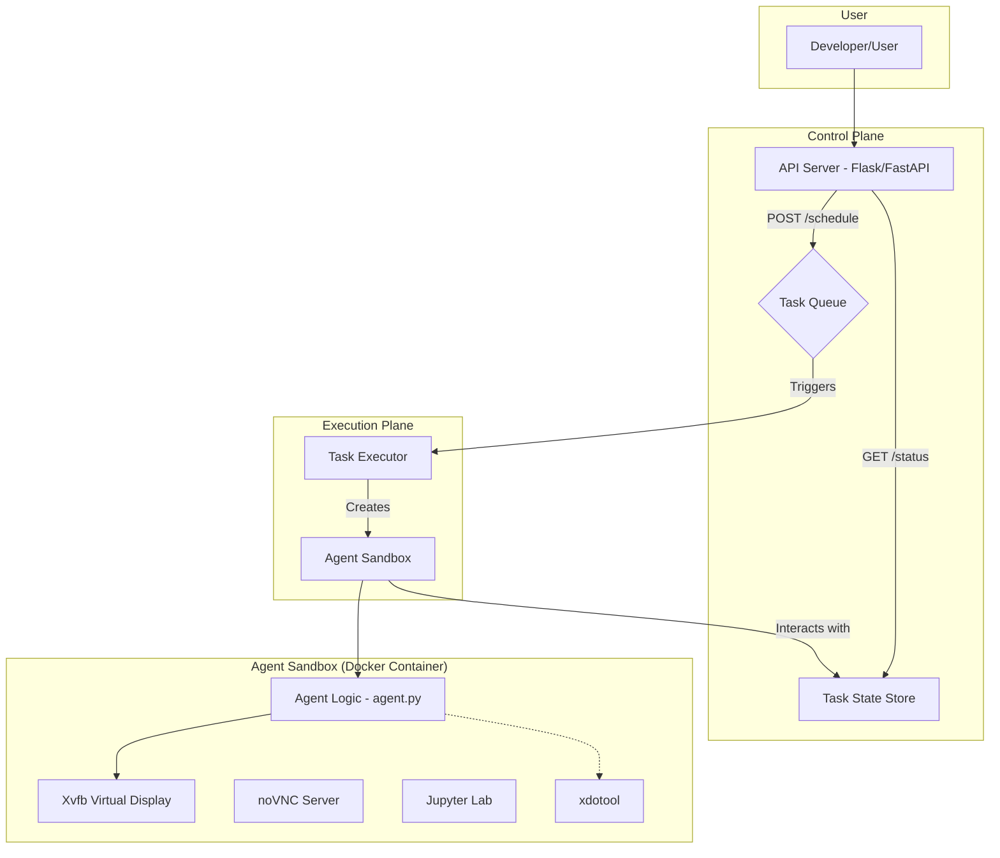
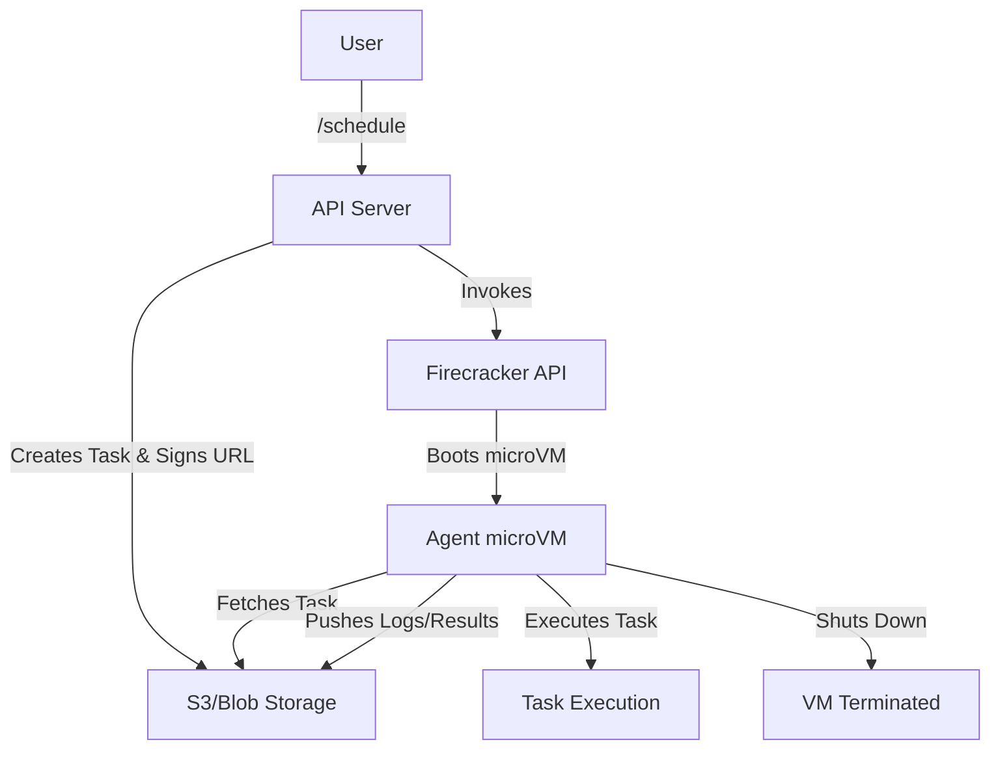

# General-Purpose Coding Agent

This project is a prototype of a general-purpose coding agent built for the Runable 40 LPA system-building challenge. The goal is to create a robust, secure, and scalable system capable of executing code, running shell commands, and interacting with a GUI in a sandboxed environment.

This prototype focuses on demonstrating strong architectural principles and a clear path to a production-ready system, even if not all features are fully implemented within the time limit.

## ► Core Features

*   **Secure Code & Command Execution:** Executes shell commands, Python, and TypeScript code in an isolated environment.
*   **File System Manipulation:** Can read from and write to files within a sandboxed working directory.
*   **GUI Automation:** Interacts with a virtual desktop environment using `xdotool` to simulate keyboard and mouse events.
*   **Persistent Memory:** Maintains context and history for each task using a simple file-based approach.
*   **Web-based GUI Access:** A `noVNC` client allows real-time viewing and interaction with the agent's desktop.
*   **Interactive Inspection:** A built-in `Jupyter Lab` instance for debugging and inspecting the agent's environment.
*   **Asynchronous Task Management:** A simple API to schedule tasks and check their status without blocking.

## 🏛️ Architecture

The system is designed with modularity and security at its core. It separates the control plane (API) from the execution plane (the agent itself).

### High-Level Diagram



### Component Breakdown

1.  **Control API (`/api/server.py`)**
    *   A lightweight Flask/FastAPI server acts as the entry point for the system.
    *   **`/schedule` (POST):** Receives a JSON payload defining a task (e.g., a sequence of shell commands or code snippets). It generates a unique `task_id`, creates a dedicated directory (`/tasks/{task_id}`), and triggers the task execution asynchronously. It immediately returns the `task_id`.
    *   **`/status` (GET):** Accepts a `task_id` and returns the current state of the task (e.g., `scheduled`, `running`, `completed`, `failed`) by reading from a status file in the task's directory.

2.  **The Agent Sandbox (Dockerfile)**
    *   Each task is executed inside a heavily customized Docker container to ensure isolation.
    *   **OS:** Based on a stable `ubuntu:22.04` image.
    *   **Virtual Display:** `Xvfb` (X Virtual Framebuffer) creates a headless display, allowing GUI applications to run without a physical monitor.
    *   **Remote Access:** `x11vnc` serves the Xvfb display, and `noVNC` provides a web-socket to VNC gateway, making the agent's desktop viewable from any modern web browser.
    *   **Core Tools:** The container comes pre-installed with `python3`, `nodejs`, `xdotool`, and `jupyterlab`.
    *   **Security:** Runs as a **non-root user** to minimize the impact of a potential container breakout.

3.  **Task Executor & Agent Logic (`/agent/agent.py`)**
    *   When a task is scheduled, an instance of the `Agent` class is created.
    *   It operates exclusively within its assigned directory (`/tasks/{task_id}`), preventing it from accessing or modifying other parts of the system.
    *   **Capabilities:** The agent has methods like `run_shell()`, `run_python()`, `read_file()`, and `write_file()`. All actions are logged to `/tasks/{task_id}/agent.log`.
    *   **Memory:** A simple `memory.json` file in the task directory stores the history of actions and their results, providing long-term context that can be re-loaded by the agent.

## 🔐 Security Considerations

Security is paramount for a system that executes arbitrary code.

1.  **Containerization:** Docker provides the primary layer of isolation, separating the agent's environment from the host machine.
2.  **Non-Root Execution:** The agent process and all its sub-processes are run by a low-privilege user inside the container, drastically reducing the attack surface.
3.  **Sandboxed Working Directory:** Each task is chrooted to its own directory (`/tasks/{task_id}`), preventing one task from interfering with another.
4.  **Secure Subprocess Handling:** The `subprocess` module in Python is used carefully, avoiding `shell=True` with untrusted input to prevent shell injection vulnerabilities. Timeouts are enforced on commands to stop malicious or hung processes.

### Future Security Enhancements

*   **Firecracker MicroVMs:** For true "serverless" security, each task would be executed in its own Firecracker microVM. This provides hardware-virtualization-enforced isolation, which is far stronger than containerization alone.
*   **Seccomp/AppArmor Profiles:** Applying fine-grained seccomp or AppArmor profiles to the container would restrict the specific system calls the agent can make, further limiting its capabilities.
*   **Network Policies:** Strict network policies would be enforced to control outbound traffic from the agent, preventing it from accessing unauthorized network resources.

## 🚀 Scalability Strategy

The architecture is designed to scale horizontally to handle many concurrent tasks.

### 1. Scaling with Firecracker (Per-Task VM Isolation)

This is the preferred model for maximum security and scalability.



*   The API server becomes a lightweight task orchestrator.
*   Instead of running a Docker container, it uses the Firecracker API to launch a new microVM for each task.
*   The task definition is passed securely to the VM on startup.
*   The VM executes the task in complete isolation and shuts down upon completion, ensuring a clean, stateless, and highly secure execution environment.

### 2. Horizontal Scaling with Kubernetes/Nomad

For a more traditional cloud-native approach, the system can be deployed on a container orchestrator like Kubernetes.

*   **Deployment:** The entire system would be packaged as a Helm chart.
*   **Task as a Job:** The `/schedule` endpoint would translate each task request into a Kubernetes `Job` object.
*   **Dynamic Scaling:** The Kubernetes cluster can be configured with a Cluster Autoscaler to automatically add or remove nodes based on the number of pending agent `Jobs`.
*   **Resilience:** Kubernetes handles pod failures, rescheduling, and ensures the API server is always available.
*   **State & Logging:** `PersistentVolumes` would be used for the `/tasks` directory, and logs would be aggregated using a standard logging stack (e.g., EFK - Elasticsearch, Fluentd, Kibana).

## 🛠️ Setup and Usage

### Prerequisites

*   Docker
*   Git
*   `curl` (or any API client)

### 1. Installation

```bash
# Clone the repository
git clone <your-repo-url>
cd coding-agent

# Build the Docker image
docker build -t coding-agent .
```

### 2. Running the System

```bash
# Run the container and map the necessary ports
# 8000: API Server
# 8080: noVNC Web Client
# 8888: Jupyter Lab
docker run -d --name my-agent \
  -p 8000:8000 \
  -p 8080:8080 \
  -p 8888:8888 \
  coding-agent
```

### 3. Interacting with the Agent

*   **View GUI:** Open your browser and navigate to `http://localhost:8080`.
*   **Use Jupyter:** Open your browser and navigate to `http://localhost:8888`.
*   **Schedule a Task:** Use `curl` to send a task to the API.

    *Example Task: List files and then write a Python script.*
    ```bash
    curl -X POST http://localhost:8000/schedule \
    -H "Content-Type: application/json" \
    -d '{
      "steps": [
        {
          "tool": "shell",
          "command": "ls -la /app"
        },
        {
          "tool": "python",
          "code": "with open(\"hello.txt\", \"w\") as f: f.write(\"Hello from the agent!\")"
        },
        {
          "tool": "shell",
          "command": "cat hello.txt"
        }
      ]
    }'
    ```
    This will return a `task_id`, for example: `{"task_id": "a1b2c3d4"}`.

*   **Check Task Status:**

    ```bash
    curl http://localhost:8000/status?task_id=a1b2c3d4
    ```
    This will return the current status and a path to the logs.

## 🔮 Future Work

*   **Advanced Memory System:** Replace the simple file-based memory with a Vector Database (e.g., Pinecone, Chroma) to enable semantic search over past interactions.
*   **Sophisticated Planner:** Implement a more intelligent planning module (potentially using an LLM) that can break down a high-level goal (e.g., "deploy this website") into a sequence of executable steps.
*   **Tool Integration Framework:** Create a framework for easily adding new tools (e.g., a web browser automation tool like Selenium, an API client tool) to the agent's capabilities.